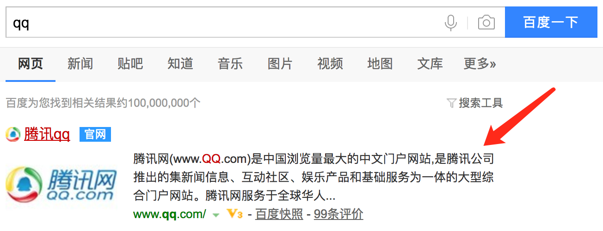

# HTML 头部

* `<head>` 的内容不会在浏览器中显示，它的作用是包含一些页面的元数据。
* 元数据 (Metadata): 描述数据的数据 (a set of data that describes and gives information about other data)

```html
<head>
  <meta charset="utf-8">
  <meta name="viewport" content="width=device-width, initial-scale=1.0">
  <title>李白的博客</title>
</head>
```
* `<title>` 是用来表示整个HTML文档大致内容的元数据(不是文档的内容)

## 元数据 `<meta>`
### 指定文档编码
```html
<meta charset="utf-8">
```

### 适配移动页面
```html
<meta name="viewport" content="width=device-width, initial-scale=1.0">
```

### 定制页面图标
```html
<link rel="shortcut icon" href="favicon.ico" type="image/x-icon">
```

### 添加页面描述
```html
<meta name="description" content="腾讯网(www.QQ.com)是中国浏览量最大的中文门户网站，是腾讯公司推出的集新闻信息、互动社区、娱乐产品和基础服务为一体的大型综合门户网站。腾讯网服务于全球华人用户，致力成为最具传播力和互动性，权威、主流、时尚的互联网媒体平台。通过强大的实时新闻和全面深入的信息资讯服务，为中国数以亿计的互联网用户提供富有创意的网上新生活。">
```


## 应用 CSS 和 JS
```html
<link rel="stylesheet" href="app.css">
<script src="app.js"></script>
```

## 参考链接
* https://developer.mozilla.org/en-US/docs/Learn/HTML/Introduction_to_HTML/The_head_metadata_in_HTML
* https://github.com/joshbuchea/HEAD
