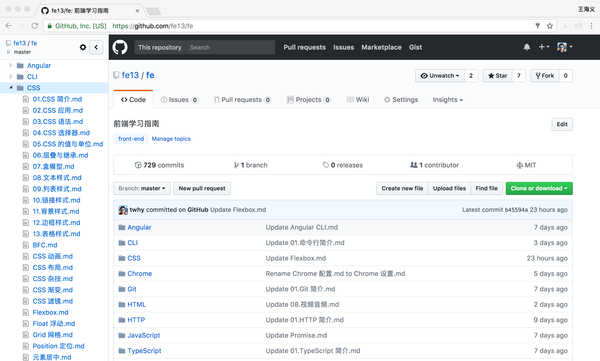

# 前端学习指南

## 安装 Octotree Chrome 插件
Octotree 会在你浏览 Github 的时候生成文件树，方便浏览文件。
* [Github下载地址](https://github.com/buunguyen/octotree/raw/master/dist/chrome.crx) 下载完成后，进入 chrome://extensions 页面，将插件拖入该页面进行安装。
* [Chrome Store 下载地址（需翻墙）](https://chrome.google.com/webstore/detail/octotree/bkhaagjahfmjljalopjnoealnfndnagc?hl=zh-CN])


## MDN 切换中文
### 方法一：修改 URL
将 URL 中的 en-US 换成 zh-CN。
```html
https://developer.mozilla.org/en-US/docs/Learn/CSS/Styling_boxes/Backgrounds
```

### 方法二：语言菜单
通过页面右上方 `LANGUAGES` 菜单进行切换
